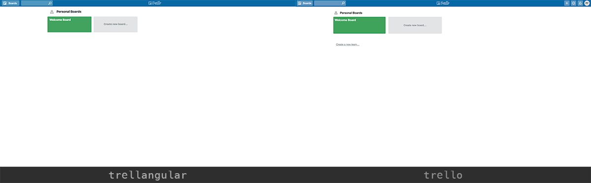
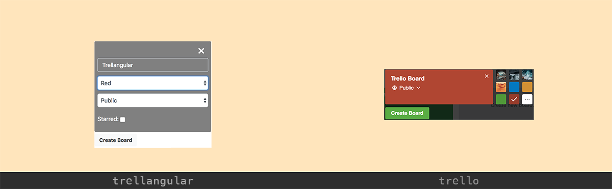
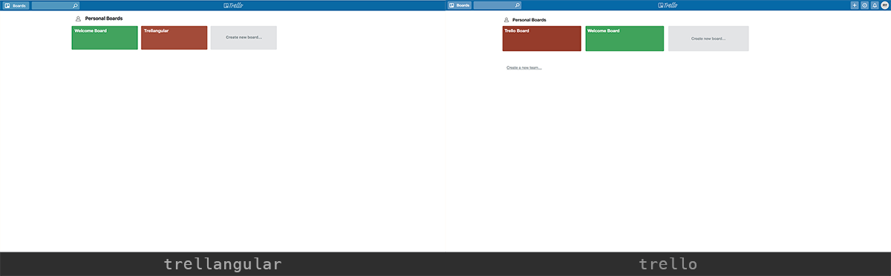
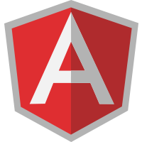
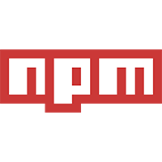

# Trellangular
###### By Roger Yee | 4/6/18

## Description
Trellangular was developed as a practice exercise for the implementation and utilization of the Angular javascript framework alongside Google's database service, Firebase. Trellangular's main attempt was not only to replicate the functionality of Trello, but really capture the aesthetic aspect as well.

#### Dashboard Comparison

---

#### Create Board comparison

---

#### New Board Comparison

---

## Features & Functionalities
###### Currently
- [x] View all existing boards on the dashboard page
- [x] Create additional boards from the dashboard page
- [x] Assign each board a unique title and color
- [x] Set a board's privacy to either private or public
- [x] 'Star' a board to signify priority or importance
- [x] Access each board's unique page

###### Future
- [ ] Generate unique columns
- [ ] Add unique cards nested within existing columns
- [ ] Assign descriptions, tags, colors, and more to cards
- [ ] User authentication for users to have their own set of boards
- [ ] Board/card search functionality

## Prerequisites

###### Application dependencies:

* [Git](https://git-scm.com/) - repository access/cloning
* [Node](https://nodejs.org/) + [NPM (Node Package Manager)](https://www.npmjs.com/) - package and dependency installation
* [TypeScript](https://www.typescriptlang.org/) - compiles project files for accessibility

## Setup

1. Open Terminal (or terminal equivalent)

2. Clone Repository
  `$ git clone https://github.com/ryee926/trellangular`

3. Install Application Dependencies using npm:
  `$ npm install`

4. Launch Server
 `$ ng serve --open`

5. Visit Webpage

This project was generated with [Angular CLI](https://github.com/angular/angular-cli) version 1.6.5.

## Technologies Used
    

## Contact
For all questions & inquiries, email ryee926@gmail.com.

## License
MIT License
Copyright (c) 2018 Roger Yee

---

###### Additional Disclaimer
This clone was created for the sole purpose of angular/firebase implementation practice and has no intention of distribution or public use in any shape or form.
